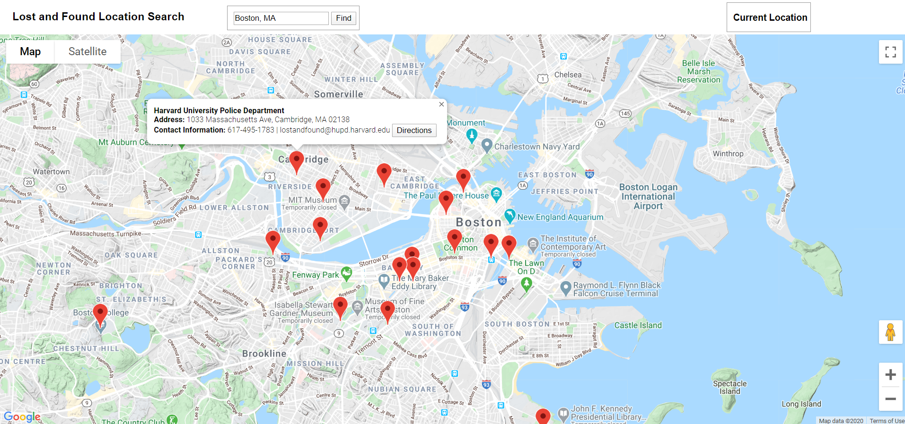

# google_maps_api_interface
Interactive and searchable map-based interface that utilizes Google Maps API, Javascript and HTML/CSS. Displays lost and found locations in Boston as markers with information windows. Includes option to find directions from current location to an existing lost and found marker.

